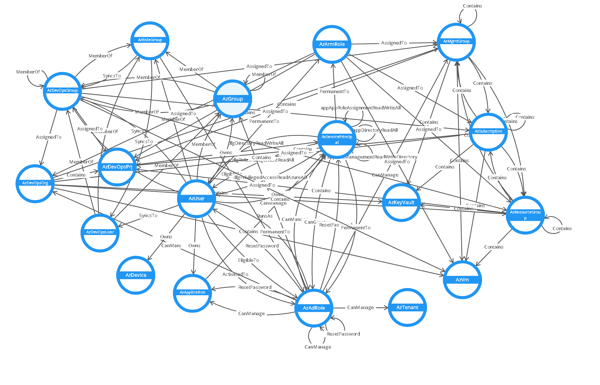

# BloodHoundAz

This project is an experimental version of BloodHound Version 4.0.3. The version adds other nodes and edges to the graph, such as Azure DevOps.

## Required Permissions

For the best result the user should have the following rights:

- ARM Reader Role (At the root Mgmt Group)
- Azure AD Global Reader
- Approved PrivilegedAccess.Read.AzureAD App Role
- Approved PrivilegedAccess.Read.AzureADGroup App Role
- Approved PrivilegedAccess.Read.AzureResources App Role

## To collect the data

1. Import-Module Collectors/AzHound.ps1
2. Invoke-AzHound

## Import

[Import Readme](https://github.com/m8r1us/BloodHoundAz/blob/main/Importer/readme.md)

## BloodHound GUI

The BloodHound GUI was only modified to display the new edges and nodes. The menu functionality still needs to be implemented. Therefore, to navigate through the graph, use either the shortest path option menu on a node or type the cypher query by enabling the debug mode.

